# Overpass

- Mode: CTF
- Difficulty: Easy
- URL: <a href="https://tryhackme.com/r/room/overpass" target="_blank">link</a>

## Skills Learned

- 
- 
- 

## Tools Used

- 
- 
- 

## CTF Information

What happens when a group of broke Computer Science students try to make a password manager?
Obviously a perfect commercial success!

## Writeup:

**Question 1: Hack the machine and get the flag in user.txt**

1. NMap

NMap run

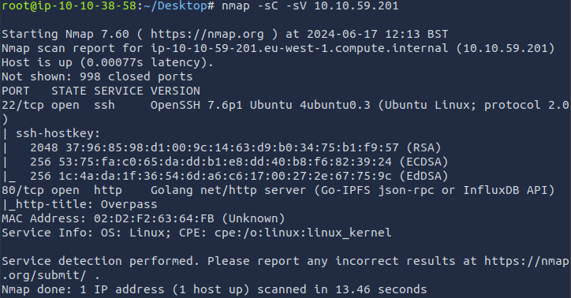

2. Recon on website

Front page

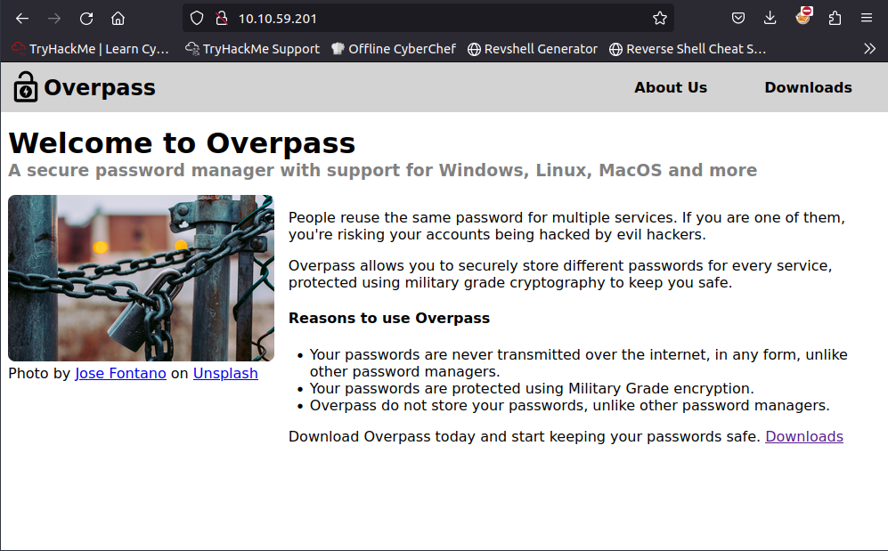

Downloads page

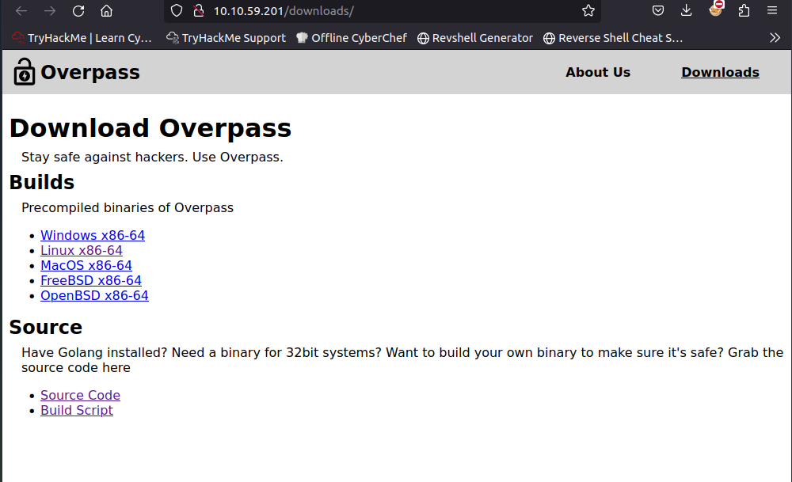

About Us page

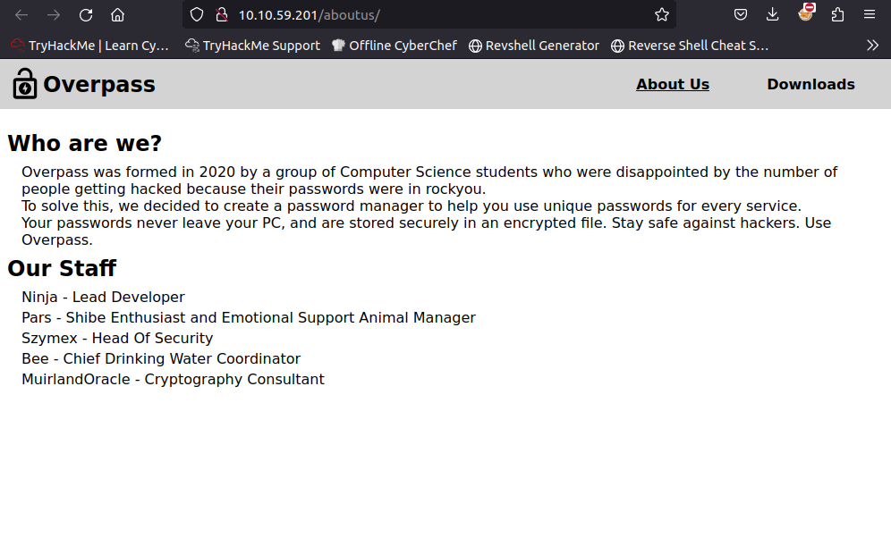

3. Testing binaries for overpass

Running binary files for linux overpass

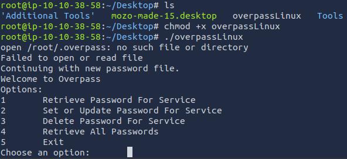

4. Running "nikto" and testing injection in login

Running nikto

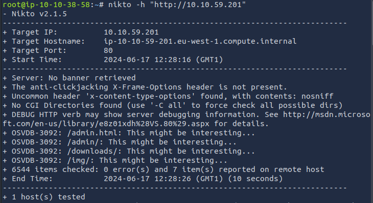

5. Reading login.js

Front page login

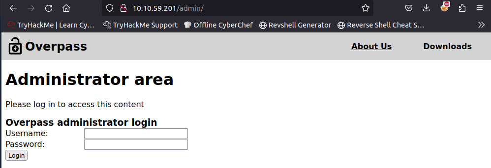

Code login

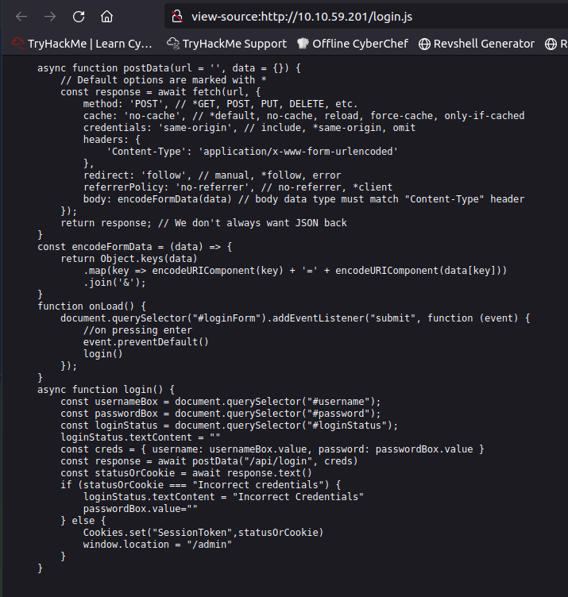

6. Testing cookie editing for admin access

We set the "SessionToken" value to be "test" to see if any sessiontoken value will give admin access

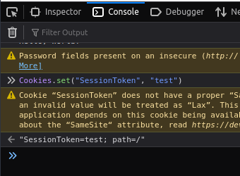

After refresh of website we see that we are given admin access.

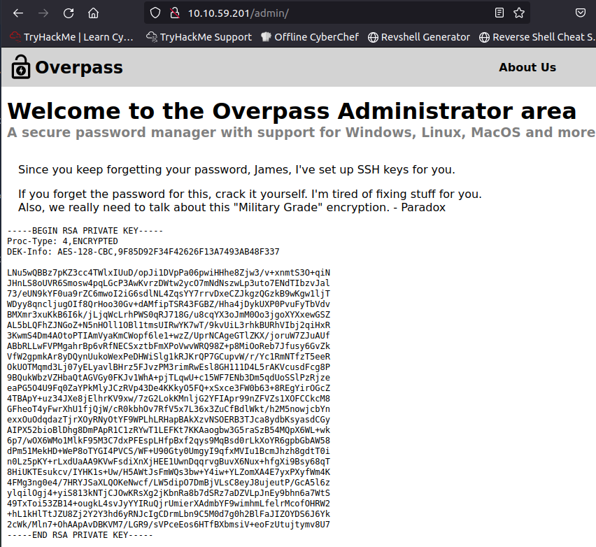

7. Adding id_rsa to a file

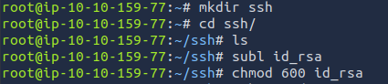

8. Testing ssh for user james with id_rsa

Did not work we dont have passsword

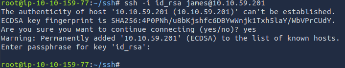

9. Password cracking using john the ripper

Running john the ripper on id_rsa file

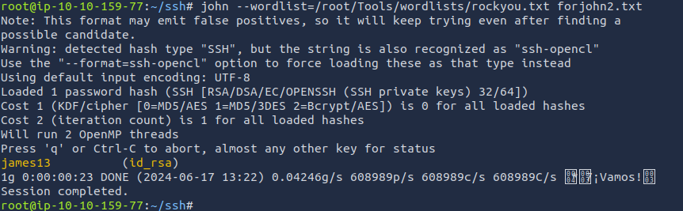

By entering james13 in the passphrase for key "id_rsa" we are logged in.

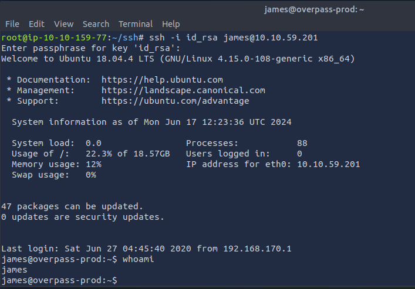

We take a look in the machine and locate the first flag

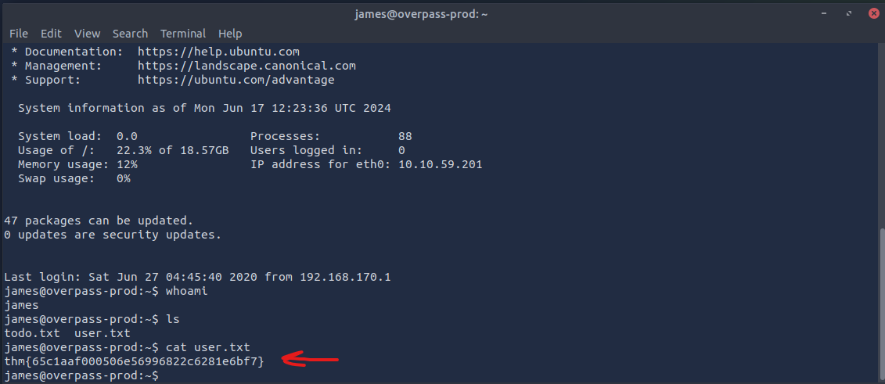

**Question 2: Escalate your privileges and get the flag in root.txt**

We look more into the machine

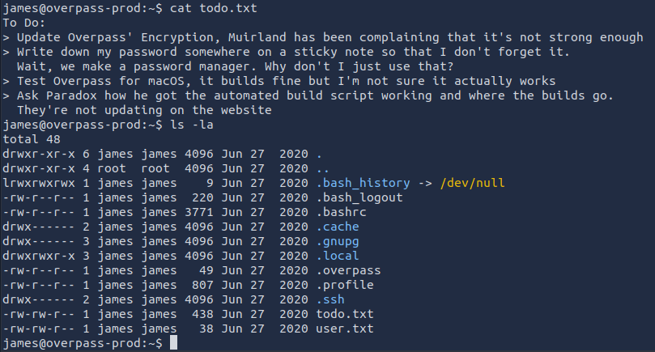

Looking for hidden direcotriies

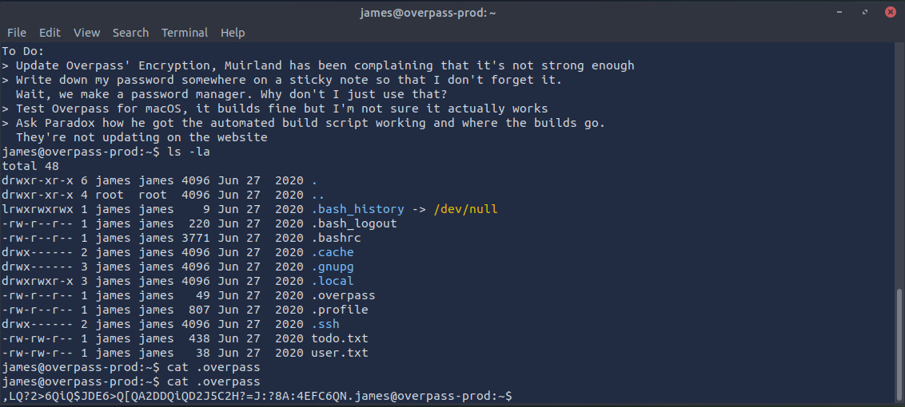

Decrypt using rot37 decoder on web.

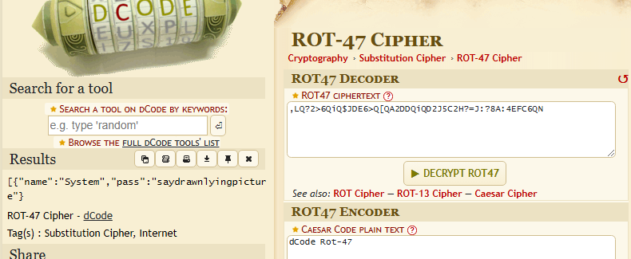

## Conclusion