# Room

<a href="https://tryhackme.com/r/room/wiresharkpacketoperations" target="_blank">Wireshark: Packet Operations</a>

## Objective

The purpose of this room is to learn the fundementals of packet analysis with Wireshark and how to find the needle in a haystack!

## Skills Learned

- Mastering Wireshark Statistics
- Advanced Filtering Techniques
- Using Wireshark Operators and Functions

## Tools Used

- Wireshark for capturing and examining network traffic.

## Writeup:

### Task 1 - Introduction (no questions)

In the virtual machine that is attached to the room we are given a file "Exercise.pcapng" for use in tasks.

### Task 2 - Statistics | Summary

**Investigate the resolved addresses. What is the IP address of the hostname starts with "bbc"?**

By opening the "Resolved Addresses" window under "Statistics" we are able to search for an entry in the "Hotst" tab. We search with they key word "bbc" which reveals the IP address.

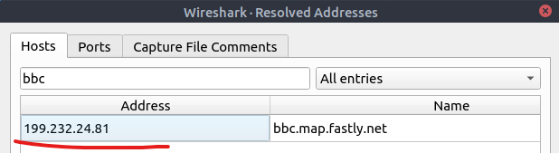

**What is the number of IPv4 conversations?**

To view this we open the "Conversations" option under the "Statistics" menu. And look at the number in the IPv4 tab

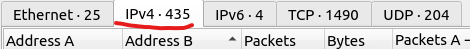

**How many bytes (k) were transferred from the "Micro-St" MAC address?**

We can locate the amount of bytes (k) that were transferred from "Micro-St" by clicking on "Endpoints" under the "Statistics" menu.

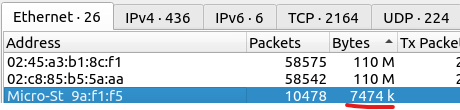

**What is the number of IP addresses linked with "Kansas City"?**

In the "Endpoints" we can sort by Alphabet in the "City" column and scroll untill we can locate the IP addresses linked with Kansas City. We find that there are a total of 4 linked.

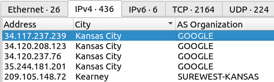

**Which IP address is linked with "Blicnet" AS Organisation?**

We can look in the "Endpoints" under the "Statistics" menu. We can sort by "AS Organization" to more easily locate "Blicnet" since it is sorted alphabetically.

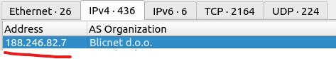

### Task 3 - Statistics | Protocol Details

**What is the most used IPv4 destination address?**

We choose Statistics -> IPv4 Statistics -> Destinations and Ports. After this we sort by count and we can then look at the port at the top of the list with the most destination addresses.

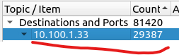

**What is the max service request-response time of the DNS packets?**

We choose Statistics -> DNA. Then we can locate the "request.response time(secs)" max value.

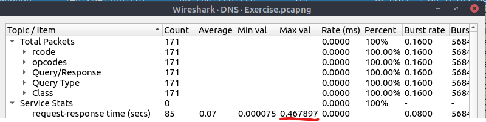

**What is the number of HTTP Requests accomplished by "rad[.]msn[.]com?**

We choose Statistics -> HTTP -> Load Distribution which shows a window with every address and the number of requests for it. Sort by Topic/Item and then we scroll until we find the URL and then look at the count

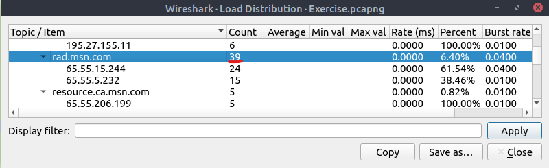

### Task 4 - Packet Filtering | Principles (no questions)

### Task 5 - Packet Filtering | Protocol Filters

**What is the number of IP packets?**

Before we can read of the packets in the status bar we have to filter so we only get the IP packets and we do this by typing "ip" in the bar. We can now read of the "Displayed" number value and get the total number of IP packets.

**What is the number of packets with a "TTL value less than 10"?**

We do the same as above but we apply a new filter "ip.ttl < 10" and hit enter. We can now read of the totalt number of packets with a TTL value of less then 10.

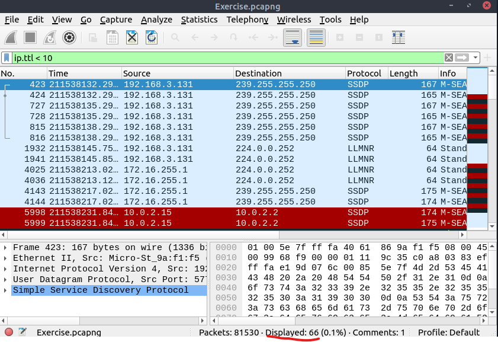

**What is the number of packets which uses "TCP port 4444"?**

Same as above but with new filter "tcp.port == 4444". We can now read of the number of packets which uses TCP port 4444.

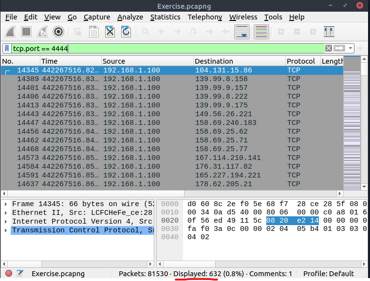

**What is the number of "HTTP GET" requests sent to port "80"?**

Same as above but with a new filter "tcp.port == 80 && http.request.method == "GET"". We can now read of the number of HTTP GET request sent to port 80.

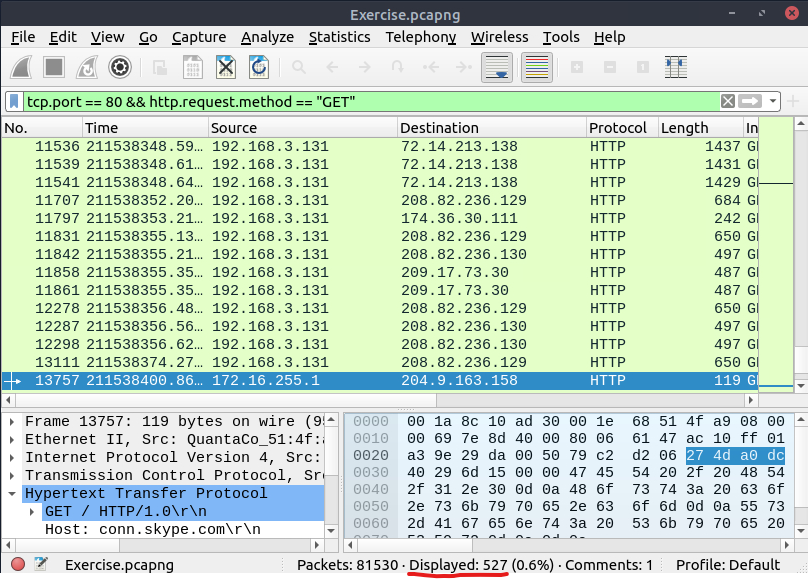

**What is the number of "type A DNS Queries"?**

We know that DNS queries have a list of different flags that are used for checks and specify things about the message. In this particular case we are just looking for the response flag to be marked as 1. We also need packets to be type A queries. This will require to use two different DNS flags. The first part of the filter is to set the DNS query to type A which is this part: "dns.qry.type == 1". The second part is usewd to make sure the response flag is set to 1: "dns.flag.response == 1". We combine these with the && operator and can now read the total number in the status bar.

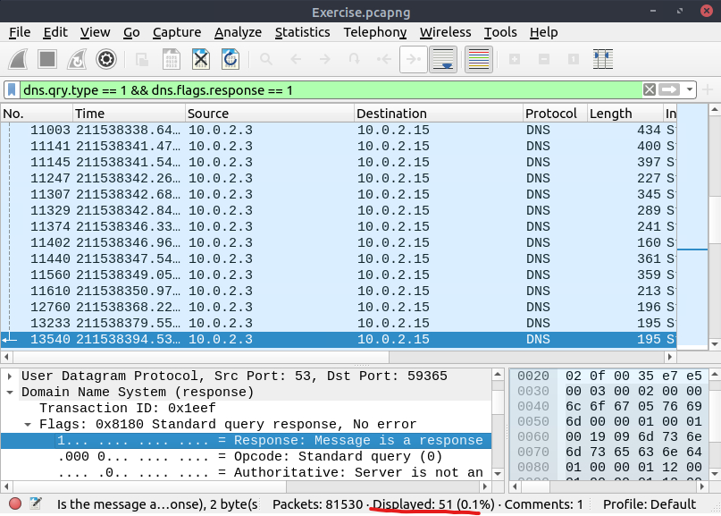

### Task 6 - Advanced Filtering

**Find all Microsoft IIS servers. What is the number of packets that did not originate from "port 80"?**

To find the pakcets that are using IIS server we can use the filter: "http.server contains "IIS". To check that the packet is not using port 80 we can use the following filter: "!(tcp.srcport == 80)" where the "!" operator works as "not". After we combine these two filters we can read of the number of packets in the status bar.

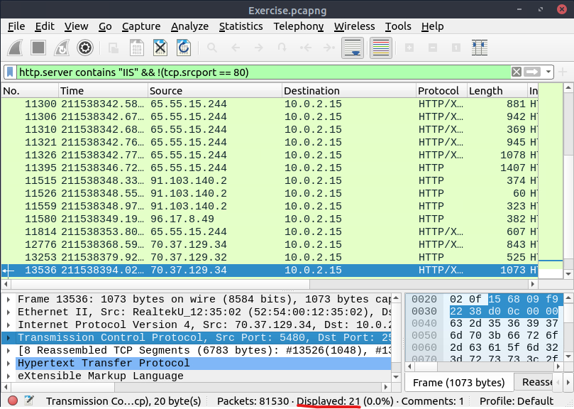

**Find all Microsoft IIS servers. What is the number of packets that have "version 7.5"?**

Similar to last question but we replace the last part with "http.server matches "7.5" to find all that packets that are using version 7.5.

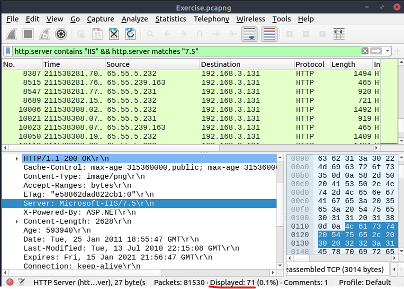

**What is the total number of packets that use ports 3333, 4444 or 9999?**

Similar to the question we did in task 5, but now we are filtering for three ports. We can do this by using the "in" operator combined with the list of the three ports which are surrounded by "{}".

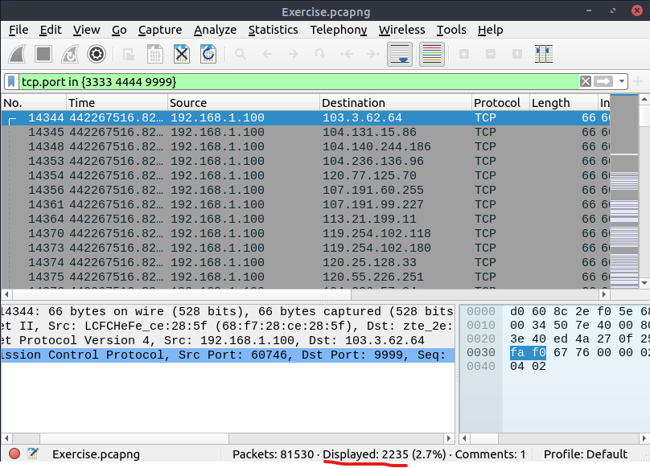

**What is the number of packets with "even TTL numbers"?**

To check this we have to convert the ttl value to a sting: "string(ip.ttl)" and then match it "matches" with "[02468]$" (which are even numbers) to see if it ends with an even number.

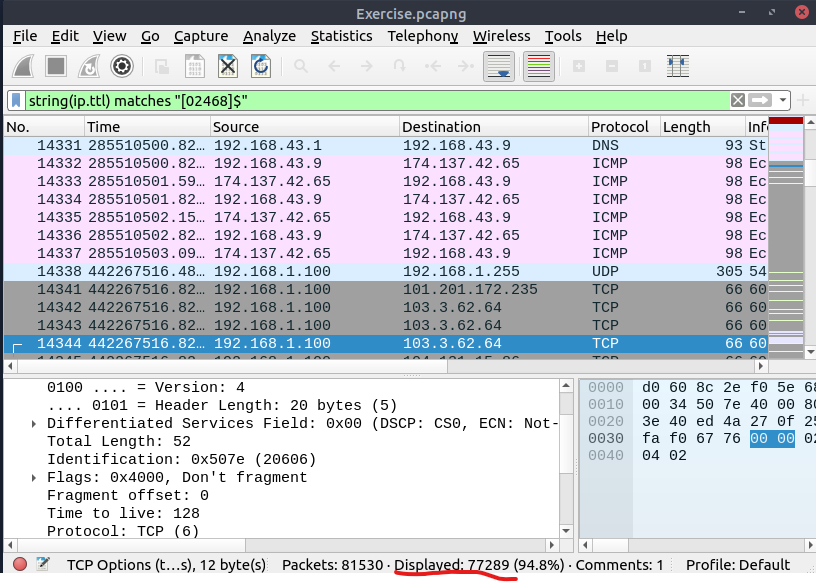

**Change the profile to "Checksum Control". What is the number of "Bad TCP Checksum" packets?**

We can configure the profile by navigating to Edit -> Configuration Profiles -> Checksum Control -> OK. Thisn profile then highlights packets which has failed checksums. Now to add the filter for bad checksums we navigate to Analyze -> Display Filter Expression. In the menu that is now displayed in the image below we scroll down till we find "tcp.checksum.status" which is the correct filter to use.

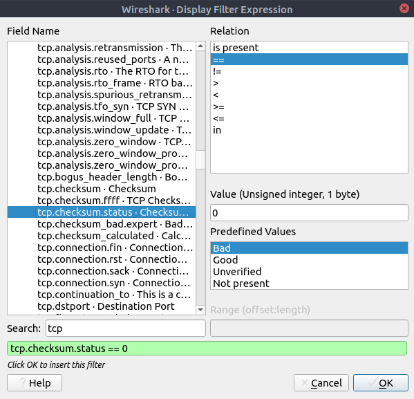

Then we click "OK" and the filter is automatically applied.

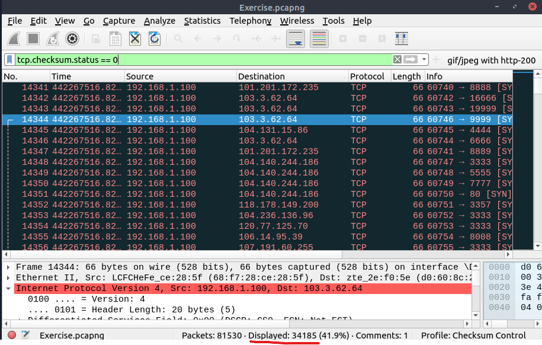

**Use the existing filtering button to filter the traffic. What is the number of displayed packets?**

In the top right corner of the Wireshark where we can see the "gif/jpeg ..." if we click on that we get the filter that is shown in the bar in this image. We then click enter adn can read of the number of displayed packets in the status bar. 

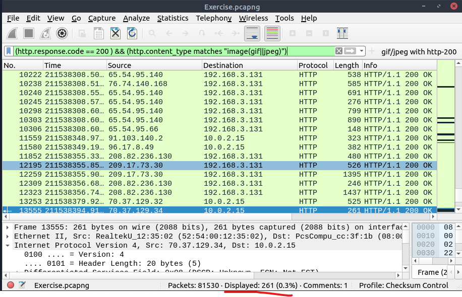

