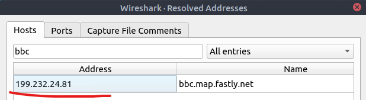
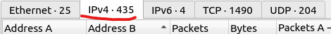
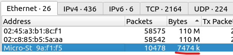
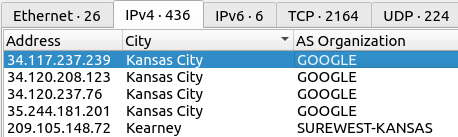
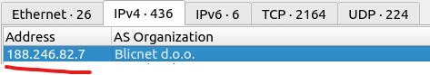

# Room

<a href="https://tryhackme.com/r/room/wiresharkpacketoperations" target="_blank">Wireshark: Packet Operations</a>

## Objective

The purpose of this room is to learn the fundementals of packet analysis with Wireshark and how to find the needle in a haystack!

## Skills Learned

- Mastering Wireshark Statistics
- Advanced Filtering Techniques
- Using Wireshark Operators and Functions

## Tools Used

- Wireshark for capturing and examining network traffic.

## Writeup:

### Task 1 - Introduction (no questions)

In the virtual machine that is attached to the room we are given a file "Exercise.pcapng" for use in tasks.

### Task 2 - Statistics | Summary

**Investigate the resolved addresses. What is the IP address of the hostname starts with "bbc"?**

By opening the "Resolved Addresses" window under "Statistics" we are able to search for an entry in the "Hotst" tab. We search with they key word "bbc" which reveals the IP address.

**What is the number of IPv4 conversations?**

To view this we open the "Conversations" option under the "Statistics" menu. And look at the number in the IPv4 tab

**How many bytes (k) were transferred from the "Micro-St" MAC address?**

We can locate the amount of bytes (k) that were transferred from "Micro-St" by clicking on "Endpoints" under the "Statistics" menu.

**What is the number of IP addresses linked with "Kansas City"?**

In the "Endpoints" we can sort by Alphabet in the "City" column and scroll untill we can locate the IP addresses linked with Kansas City. We find that there are a total of 4 linked.

**Which IP address is linked with "Blicnet" AS Organisation?**

We can look in the "Endpoints" under the "Statistics" menu. We can sort by "AS Organization" to more easily locate "Blicnet" since it is sorted alphabetically.

### Task 3 - Statistics | Protocol Details
### Task 4 - Packet Filtering | Principles
### Task 5 - Packet Filtering | Protocol Filters
### Task 6 - Advanced Filtering