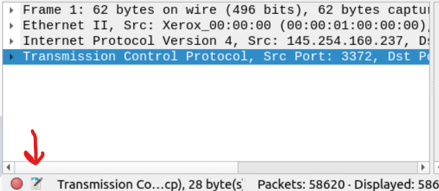
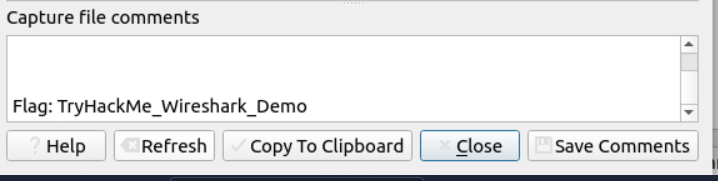
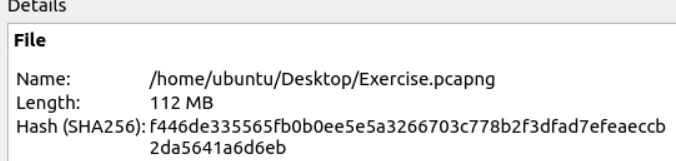

# Room

<a href="https://tryhackme.com/r/room/wiresharkthebasics " target="_blank">Wireshark: The Basics</a>

## Objective

The purpose of this room is to learn the basics of Wireshark and how to analyze protocols and PCAPs.

## Skills Learned

- Learned the basics of Wireshark
- How to analyze protocols
- Security analysis on PCAPs files

## Tools Used

- Wireshark for capturing and examining network traffic.

## Writeup:

There are two capture files in the Virtual Machine for this Room and we are given the following information about them:

"
There are two capture files given in the VM. You can use the "http1.pcapng" file to simulate the actions shown in the screenshots. Please note that you need to use the "Exercise.pcapng" file to answer the questions.
"

### Task 1 - Introduction

Which file is used to simulate the screenshots?

We find the file by just reading the information text for this task.

_Task 1: Awnser 1_

Which file is used to answer the quesions?

We find the file by reading the information text for this task.

_Task 1: Awnser 2_

### Task 2 - Tool Overview

Read the "capture file comments" what is the flag?

To find the flag we have to open the "Exercise.pcapng" file and locate the capture file comments. We are told in the informative text that you can read capture file comments by clicking no the file icon in the bottom left corner in Wireshark.

When clicking on the file icon we can scroll down and find the flag for this question.

What is the total number of packets?

We view the total amount of packets in this pcap file by looking at the status bar at the bottom of the screen.

What is the SHA256 hash value of the capture file?

We can view the SHA256 hash value of the capture file by clicking the file icon again to inspect file properties.

### Task 3 - Packet Dissection

### Task 4 - Packet Navigation

### Task 5 - Packet Filtering

### Conclusion
