# Room

<a href="https://tryhackme.com/r/room/wiresharkthebasics " target="_blank">Wireshark: The Basics</a>

## Objective

The purpose of this room is to learn the basics of Wireshark and how to analyze protocols and PCAPs.

## Skills Learned

- Learned the basics of Wireshark
- How to analyze protocols
- Security analysis on PCAPs files

## Tools Used

- Wireshark for capturing and examining network traffic.

## Writeup:

There are two capture files in the Virtual Machine for this Room and we are given the following information about them:

"
There are two capture files given in the VM. You can use the "http1.pcapng" file to simulate the actions shown in the screenshots. Please note that you need to use the "Exercise.pcapng" file to answer the questions.
"

### Task 1 - Introduction

Which file is used to simulate the screenshots?

We find the file by just reading the information text for this task.

_Task 1: Awnser 1_

Which file is used to answer the quesions?

We find the file by reading the information text for this task.

_Task 1: Awnser 2_

### Task 2 - Tool Overview

Read the "capture file comments" what is the flag?

To find the flag we have to open the "Exercise.pcapng" file and locate the capture file comments. We are told in the informative text that you can read capture file comments by clicking no the file icon in the bottom left corner in Wireshark.

When clicking on the file icon we can scroll down and find the flag for this question.

What is the total number of packets?

We view the total amount of packets in this pcap file by looking at the status bar at the bottom of the screen.

What is the SHA256 hash value of the capture file?

We can view the SHA256 hash value of the capture file by clicking the file icon again to inspect file properties.

### Task 3 - Packet Dissection

View packet number 38. Which markup language is used under the HTTP protocol?

We scroll down in the packet list to locate packet 38. We click on packet 38 to get more detailb about the packet and we can look unde the HTTP protocol and see that the "eXtensible Markup Language" is used.

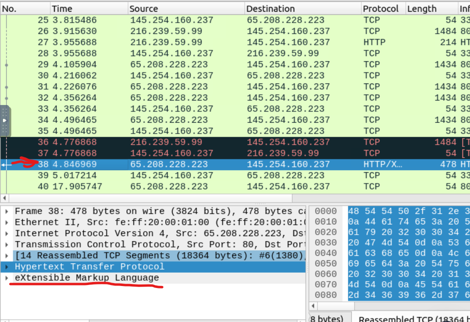

What is the arrival date of the packet?

We can click on the Frame tab in the packet information tab to find the arrival data for the packet.

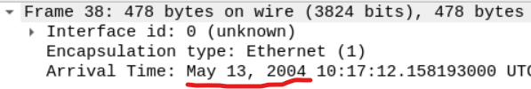

What is the TTL value?

TTL stands for Time to live and we can locate this value by clicking on the "Internet protocol" Tab (Layer 3) in the packet information tab.

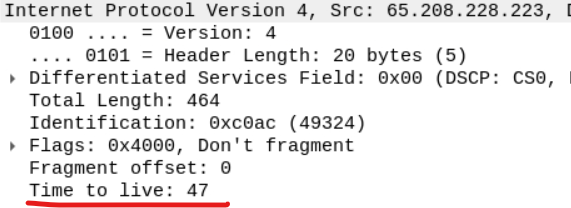

What is the TCP payload size?

The TCP payload size or segment length (which it is reffeard to in wireshark) can be located in the Transmission Control Protocol tab (Layer 4).

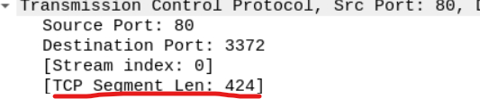

What is the e-tag value?

We can locate the e-tag value in the HTTP tab (Layer 5).

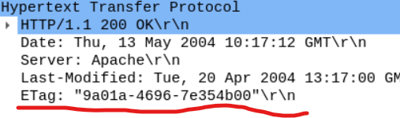

### Task 4 - Packet Navigation

Search the "r4w" string in packet details. What is the name of artist 1?

Click "Ctrl+f" to search for the string "r4w" in the packet details field. We can now read the artis1 name in the packet details tab.

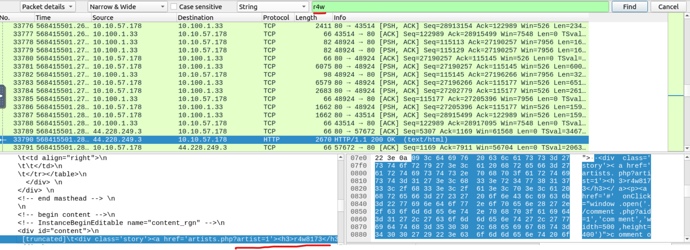

Go to packet "12" and read the comments. What is the answer?

We use the go to tool in the tool bar to locate packet 12.

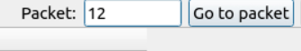

Now we can inspect packet details to find the comment for this packet.

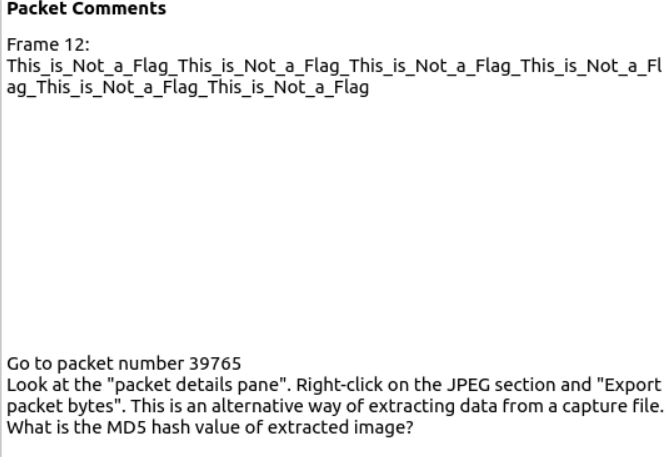

We are now instructed to go to packet number "39765".

We locate the JPEG file and right click on it and click "Export Packet Bytes".

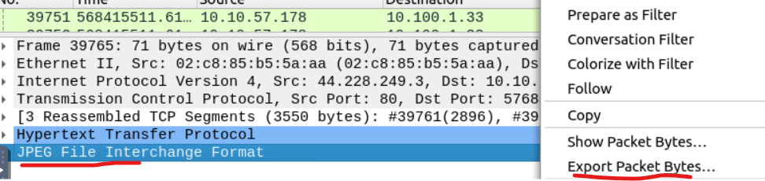

We can calculate the md5 sum by using the "md5sum" command in the terminal.

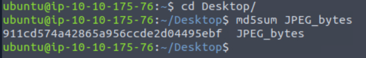

There is a ".txt" file inside the capture file. Find the file and read it; what is the alien's name?

We first have to locate the file and export the object using HTTP.

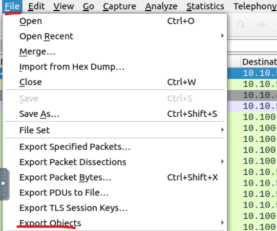

We locate the txt file and save it so we can inspect it in temrnial.

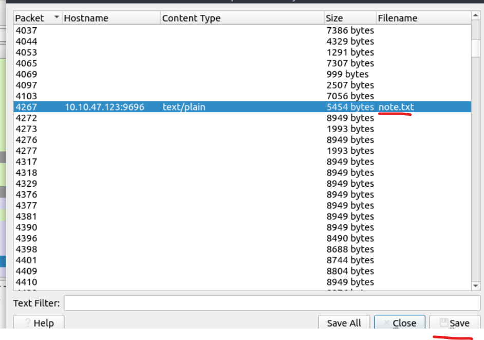

We can now inspect the file in terminal.

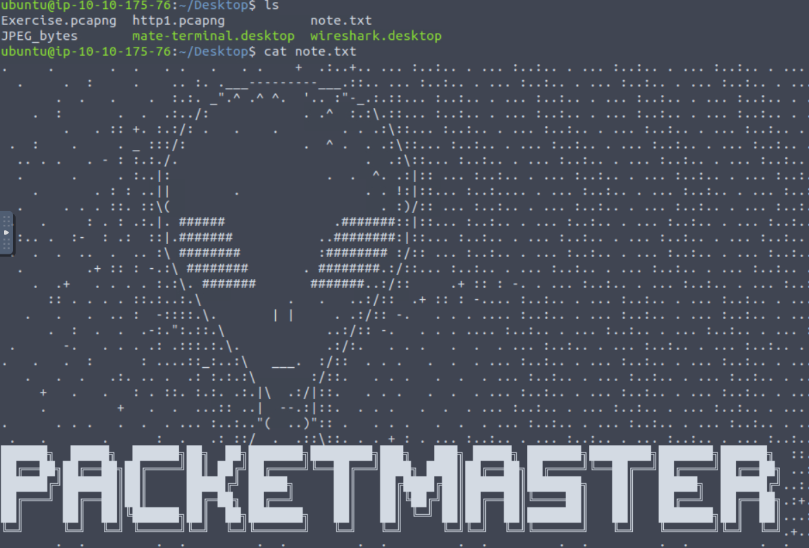

Look at the expert info section. What is the number of warnings?

We click on the red dot in the status bar to look at export info.

We can now see the total number of warnings for this file.

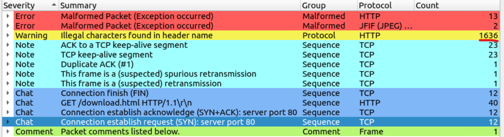

### Task 5 - Packet Filtering

### Conclusion
